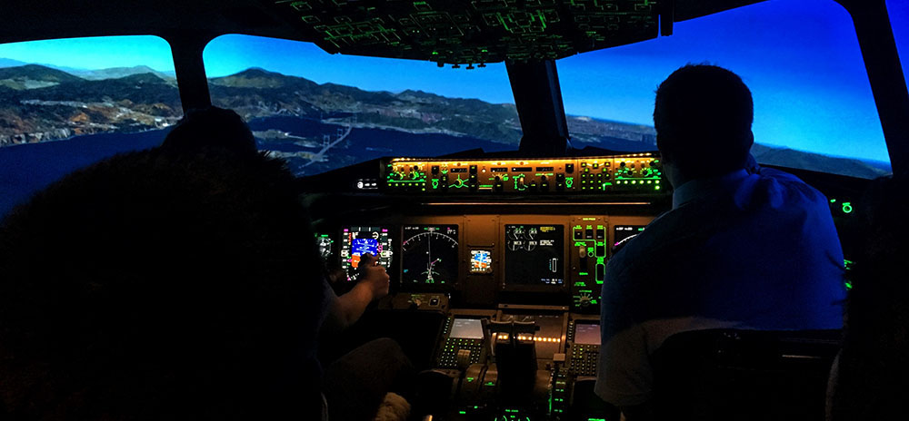

{: .no_toc }

# COM726 Support - Week 4

## Pilot Study

***A Pilot Study is an essential step in research to test and refine the study design before implementing the full-scale research project.***

**A Pilot Study allows researchers to identify potential issues, evaluate the feasibility of the study, and make necessary adjustments before investing significant time and resources into the main study.**

1. **Define Objectives:** Clearly outline the objectives of your pilot study. Know what specific research questions you want to address and what you hope to learn from the pilot.

1. **Data Collection Methods:** Choose the data collection methods that will be used in the main study. 

1. **Pre-Testing**: Before conducting the pilot study, pre-test the data collection tools. This will help identify any issues with the instruments and allow for necessary refinements.

1. **Data Analysis:** Analyse the data collected during the pilot study. While the sample size is small, you can still gain valuable insights from the data that can inform adjustments for the main study.

1. **Identify Issues and Make Adjustments:** Carefully assess the results of the pilot study and identify any potential issues or challenges. Based on the findings, make necessary adjustments to the study design, data collection methods, and procedures.

1. **Assess Feasibility:** Evaluate the feasibility of the main study based on the experiences and lessons learned from the pilot study. 

1. **Documentation:** Document the methodology, findings, and adjustments made during the pilot study. 

1. **Ethical Considerations:** Ensure that the pilot study adheres to ethical guidelines for research involving human participants. Obtain the necessary approvals and informed consent from participants.

