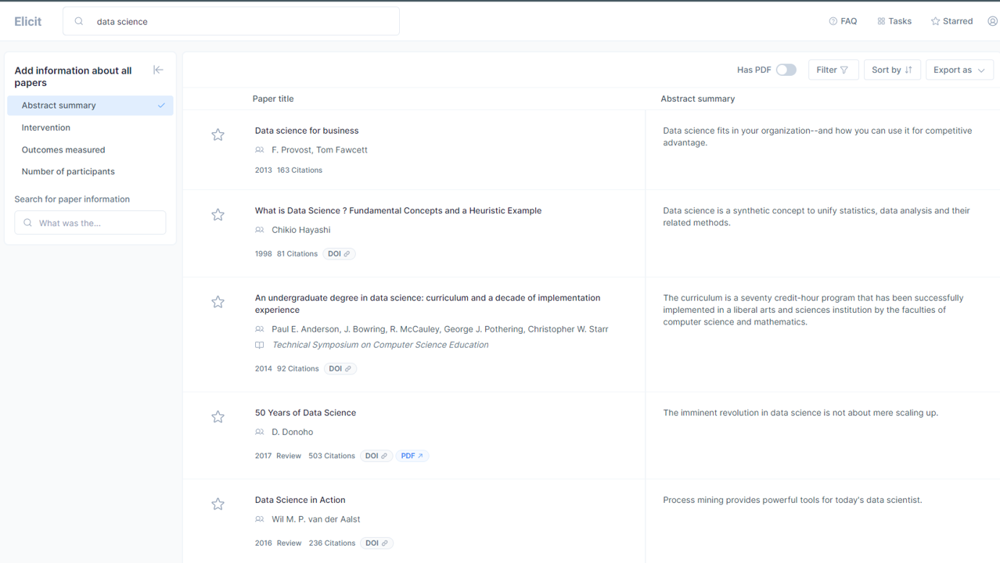
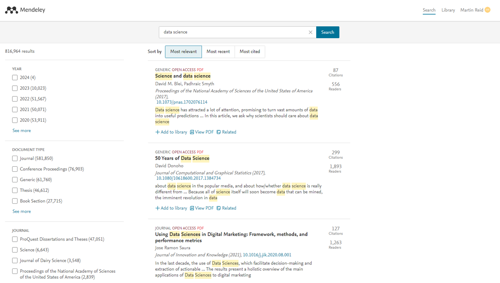
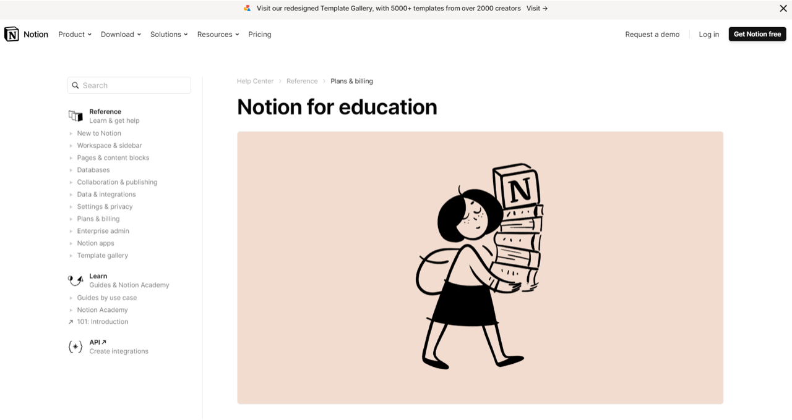

{: .no_toc }

# COM726 Support - Week 4

## Productivity Tools

[Microsoft OneNote](https://www.onenote.com/), [Slack](https://slack.com), [Notion](https://www.notion.so/help/notion-for-education), [GitHub](https://github.com 
) and cloud storage such as MicrosoftOne Drive and Google Drive. 
 
There are several tools to help you create reference, bibliography lists and add Citations in MS Word and Google Docs such should as [ProQuest RefWorks](https://refworks.proquest.com/), [mybib.com](https://www.mybib.com/), [mendeley.com](https://www.mendeley.com/), [Elicit](https://elicit.org) or similar plus Google Scholar for finding and collecting referenced sources.

## elicit.org

*Elicit uses language models to help you automate research workflows, like parts of literature review.*

*Elicit can find relevant papers without perfect keyword match, summarise takeaways from the paper specific to your question, and extract key information from the papers.*

*While answering questions with research is the main focus of Elicit, there are also other research tasks that help with brainstorming, summarisation, and text classification.*

[elicit.org](https://elicit.org/)

## mendeley.com

Mendeley is a free reference manager and academic social network that can help you to organise your research, collaborate with others online and discover the latest research:

* Automatically generate bibliographies
* Collaborate easily with other researchers online
* Easily import papers from other research software
* Find relevant papers based on what you are reading
* Access your papers from anywhere online

[mendeley.com](https://www.mendeley.com/)

## notion

Notion is a freemium productivity and note-taking web application developed by Notion Labs Inc. It offers organisational tools including task management, project tracking, to-do lists, bookmarking, and more. Additional offline features are offered by desktop and mobile applications available for Windows, macOS, Android, and iOS. Users can create custom templates, embed videos and web content, and collaborate with others in real-time.

[notion.so](https://www.notion.so/help/notion-for-education) 
