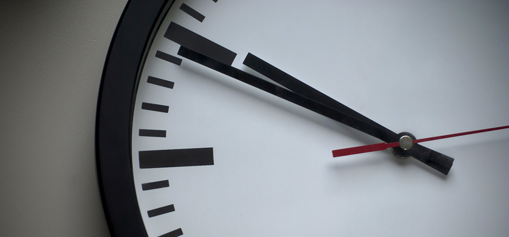

{: .no_toc }

# COM726 Support - Week 4

## Project planning & Pilot Study

This section offers guidance in undertaking a pilot study for your research project which will be part of the first assessment element in COM726 Progress report. 
We will also look at how to manage your project from beginning to end and look at some of the tools and platforms to help organise our research on sources

