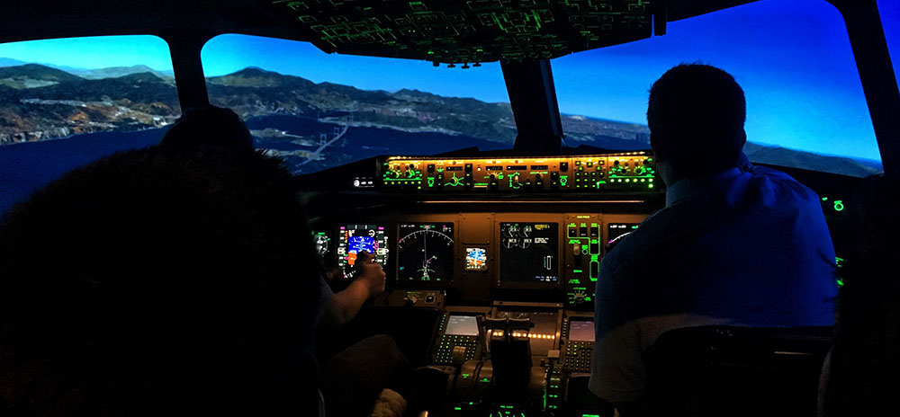

{: .no_toc }

# COM726 Support - Week 4

## Pilot Study

A Pilot Study is an essential step in research to test and refine the study design before implementing the full-scale research project.

A Pilot Study allows researchers to identify potential issues, evaluate the feasibility of the study, and make necessary adjustments before investing significant time and resources into the main study. 

