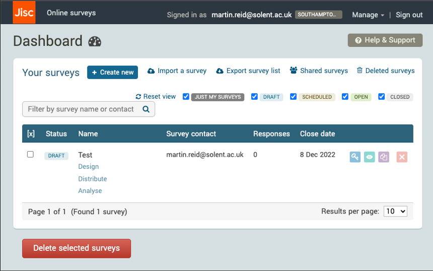

{: .no_toc }

# Survey Data Collection  

[onlinesurveys.ac.uk](https://www.onlinesurveys.ac.uk/)
onlinesurveys.ac.uk

[JISC](../img/Picture2000.jpg)

**Data collection & online survey tools**

Staff and students wishing to complete data collection via online surveys must use the University's licence for Jisc Online Surveys. If you do not have an user, you can email research.innovation@solent.ac.uk to request one or your tutor can get an invite link sent to a cohort of students.

SOLENT UNIVERSITY, 2023. Research integrity [viewed 6 July 2023]. Available from: [https://www.solent.ac.uk/research-innovation-enterprise/research-at-solent/support/ethics-and-integrity](https://www.solent.ac.uk/research-innovation-enterprise/research-at-solent/support/ethics-and-integrity)

**Do not use any of the survey platform such as survey monkey etc. for your research**

**It will be considered a breach of ethical regulations if any other survey tool is used.**

SOLENT UNIVERSITY, 2023. Successful questionnaire design: Conduct the survey [viewed 6 July 2023]. Available from: [https://learn.solent.ac.uk/mod/book/view.php?id=116236&chapterid=15322](https://learn.solent.ac.uk/mod/book/view.php?id=116236&chapterid=15322)