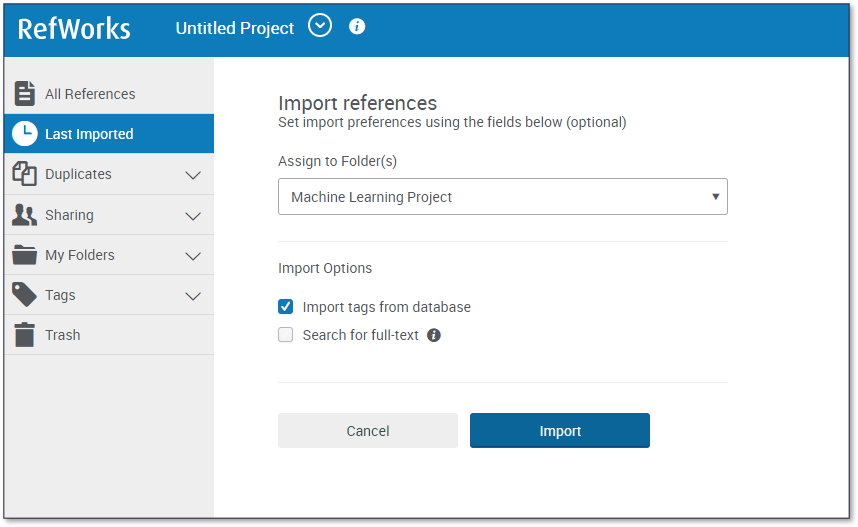
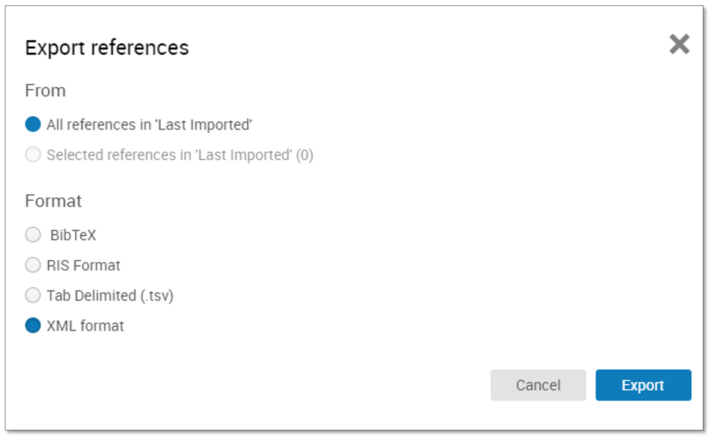

{: .no_toc }

# COM726 Support - Week 3

## The Review Protocol

#### Develop inclusion and exclusion criteria

Inclusion and exclusion criteria help you identify what you need to search for when conducting your literature review. **We will look an example of what the given criteria may look like for our chat bot application.**

#### Inclusion Criteria

- Primary sources relating to chat bots used for education or learning purposes
- English language only
- Published in peer reviewed journals
- Study took place in the last 5 years
- Empirical studies that took places in a higher education setting
- The Study reported research methods and results

#### Exclusion Criteria

- Sources that are related to chat bots not used in an educational or learning setting
- Non-English language
- Non peer reviewed sources
- Study took place over 5 years ago
- Study did not take place in a higher education setting

It is important to refer to and review your inclusion and exclusion criteria while you are searching. 

#### Identify Databases

Once you know what type of literature you need to address your research idea and have developed your inclusion and exclusion criteria, you are ready to begin searching for literature. We recommend using online academic databases to conduct your search.

While the library has subscriptions to a range of [databases](https://libguides.solent.ac.uk/az.php?s=125080), [ScienceDirect](https://www.sciencedirect.com/search/advanced) is good.

#### Identify Keywords

You should identify the keywords that capture the essence of your research topic. The rationale behind this is that journal articles are indexed on databases using keywords.

**Keywords**
The keywords for are chat bot study could be as follows:
**ChatBot, ChatBots, Chat Bot, ChatBot, Higher Education, University, Learning, Adult Education, Adults**

#### Conduct Searches

We are now ready to conduct our searches. When conducting your search you should make use of Boolean operators - AND/OR/NOT. These commands use the principles of [Boolean logic](https://libguides.mit.edu/c.php?g=175963&p=1158594), a concept that as a computing student you should be familiar with.

Using the above principles this is what our chat bot study search string might look like:

**(Chatbot OR ChatBots OR Chat Bot OR Chat Bots) AND Learning AND (Higher Education OR Adult Education OR Adults)**

https://www.sciencedirect.com/search?qs=%28Chatbot%20OR%20ChatBots%20OR%20Chat%20Bot%20OR%20Chat%20Bots%29%20AND%20Learning%20AND%20%28Higher%20Education%20OR%20Adult%20Education%20OR%20Adults%29&years=2023%2C2022%2C2021%2C2020%2C2019&articleTypes=REV&show=100&lastSelectedFacet=publicationTitles&subs=true

After conducting our search, we start applying our inclusion criteria. 

We have filtered by date and just to include research articles. 

After applying our criteria, you can see that we have 98 remaining articles. We now need to get the literature into a format that lends itself to more in-depth analysis.

#### Exporting the search results to excel

ScienceDirect does not allow direct export to Excel. 

So select all & click Export

Save to RefWork (You will need to have signed up for RefWorks and be familiar with using it)

Create & name a new RefWorks folder

Click Import

In RefWorks select your articles and click Share

Export references -> XML or tsv

**5. Review resulting literature**- the files have been opened up in Excel or a similar spreadsheet program you may need to reconfigure the table height and width.

This will allow you to be able to read all the abstracts and other supporting information within the tags from the search in each of the columns to review the value of each of the sources in this example useful ones have been highlighted green and one that have been excluded have been highlighted in red

Now we have the results in Excel, initially we can just read the abstract of each article and make a quick decision if we want to include and discard the literature. Red rows represent excluded literature and green columns represent included literature.

You now should read the remaining papers aim good quality sources. [You should aim to critically appraise and summarise each source.](https://learn.solent.ac.uk/mod/book/view.php?id=386475&chapterid=62704)

**Further Tips**

Once you have identified the key articles that relate to your research idea, it is useful to study the reference lists of those key articles for further references that may be useful to you.

If a key theme or author keeps arising in your literature results, then it is well worth conducting further research into this given author

6.Summaries each study in a table
The first step is to summaries each of the papers you have

